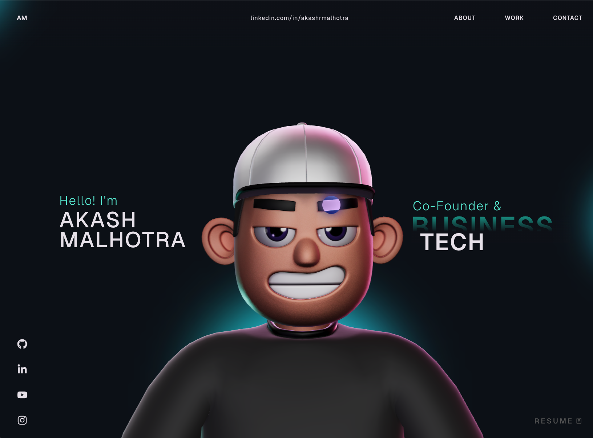

# 3D Portfolio Website

This repository contains the source code for a personal 3D portfolio built with React, TypeScript, Three.js, React Three Fiber, and GSAP. It includes animated page sections, an interactive 3D character scene, custom cursor interactions, and smooth transitions designed for an immersive and modern portfolio experience.

Live site: [https://akashrmalhotra.netlify.app/](https://akashrmalhotra.netlify.app/)



## Table of Contents

- [Features](#features)
- [Tech Stack](#tech-stack)
- [Project Structure](#project-structure)
- [Getting Started](#getting-started)
- [Available Scripts](#available-scripts)
- [GSAP License Note](#gsap-license-note)
- [Customization Guide](#customization-guide)
- [Troubleshooting](#troubleshooting)
- [Deployment](#deployment)
- [License](#license)

## Features

- **Dynamic 3D Environment**: High-performance 3D character rendering powered by Three.js, React Three Fiber (R3F), and `@react-three/drei`.
- **Cinematic Animations**: Fluid, timeline-based scroll animations and page transitions orchestrated via GSAP.
- **Interactive UI Elements**: Custom magnetic cursor, hover reactions, and smooth physics-based physics interactions.
- **Responsive Layout**: Fully responsive fluid design adapting seamlessly from mobile displays up to ultra-wide screens.
- **Optimized Performance**: Production-ready builds with lazy loading, asset preloading, and optimal chunk splitting.

## Tech Stack

### Core

- React 18
- TypeScript
- Vite

### Animation and 3D

- GSAP + `@gsap/react`
- Three.js
- `@react-three/fiber`
- `@react-three/drei`
- `@react-three/postprocessing`
- `@react-three/cannon`
- `@react-three/rapier`

### Supporting Libraries

- `react-icons`
- `react-fast-marquee`
- `@vercel/analytics`

## Project Structure

```text
.
├── public/                    # Static assets (3D models, textures, images)
├── src/
│   ├── assets/                # Local media and SVGs
│   ├── components/
│   │   ├── Character/         # 3D scene setup, custom loaders, and character utilities
│   │   ├── styles/            # Scoped CSS modules and section styles
│   │   ├── About.tsx          # About Section
│   │   ├── Career.tsx         # Career/Timeline Section
│   │   ├── Contact.tsx        # Contact Form Section
│   │   ├── Landing.tsx        # Hero/Landing Screen
│   │   ├── MainContainer.tsx  # Layout and page orchestrator
│   │   ├── Navbar.tsx         # Navigation Overlay
│   │   ├── TechStack.tsx      # Skills display with marquee integration
│   │   ├── WhatIDo.tsx        # Services/Expertise section
│   │   └── Work.tsx           # Portfolio projects showcase
│   ├── context/               # Global states (loading states, theme, animations)
│   ├── data/                  # Content JSON / static configuration files
│   ├── App.tsx                # Application shell
│   └── main.tsx               # Entry point
├── package.json
└── vite.config.ts
```

## Getting Started

### Prerequisites

Before setting up the project, make sure you have the following installed:
- **Node.js**: version 18.0.0 or higher
- **npm**: version 9.0.0 or higher (or `pnpm` / `yarn`)

### Installation

1. Clone the repository:

   ```bash
   git clone https://github.com/username/3d-portfolio.git
   cd 3d-portfolio
   ```

2. Install all project dependencies:

   ```bash
   npm install
   ```

3. Fire up the local development server:

   ```bash
   npm run dev
   ```

4. Open your browser and navigate to the URL shown in the terminal (usually `http://localhost:5173`).

## Available Scripts

In the project directory, you can run the following scripts:

- `npm run dev`  
  Launches the Vite development server with hot-module replacement (HMR).

- `npm run build`  
  Runs TypeScript type checking and compiles the production-optimized build into the `dist/` directory.

- `npm run preview`  
  Serves the built production application locally for testing and debugging.

- `npm run lint`  
  Scans the codebase for code quality and style issues using ESLint.

## GSAP License Note

This project uses the standard, publicly available `gsap` package, including the core plugins that are free to use in any public or commercial project.

- Ensure you do not commit any proprietary premium `gsap-trial` packages to public repositories.
- If you plan to use premium GSAP plugins (like `SplitText`, `DrawSVG`, or `ScrollSmoother`), make sure to configure your `.npmrc` file with your private GreenSock token.

For more details, refer to the [GSAP Installation Docs](https://gsap.com/docs/v3/Installation/).

## Customization Guide

Easily adapt this portfolio to reflect your own professional brand:

### 1. Update Content & Copy
Navigate to `src/data/` to update text blocks, project details, experience timelines, and social links. Most UI content is externalized here to make updates quick and painless.

### 2. Swapping the 3D Character/Model
- Place your `.gltf` or `.glb` files under the `public/` directory.
- Update the import path and animation clips inside the `src/components/Character/` component.
- Use tools like [gltfjsx](https://github.com/pmndrs/gltfjsx) to generate clean React Three Fiber components from your 3D models.

### 3. Modifying Styling & Theme
- **Global Variables**: Edit `src/index.css` or `src/App.css` to adjust primary/secondary theme colors, global fonts, and root variable declarations.
- **Component Styling**: Locate specific CSS files in `src/components/styles/` to fine-tune layout alignments, margins, and responsiveness.

### 4. Adjusting Animations
Modify scroll thresholds, ease equations, and transition durations inside `src/components/utils/` or directly within the `useEffect` and `useFrame` hooks of the respective components.

## Troubleshooting

- **Blank screen during development / Console errors**  
  Ensure that all assets referenced in your 3D loader paths exist inside the `public/` directory. Double-check your Node.js version.
  
- **Framerate drop / 3D lag on mobile devices**  
  - You can lower the pixel ratio density on mobile platforms by configuring the `<Canvas dpr={[1, 1.5]}>` prop.
  - Disable heavy post-processing effects (such as Bloom or depth-of-field) on mobile devices by checking the user-agent or utilizing responsive breakpoints in React.

- **TypeScript build failures**  
  Run `npm run build` locally to identify type mismatch errors before pushing changes to your deployment branch.

## Deployment

### Deploying to Netlify / Vercel

The application is fully configured for seamless deployments on Netlify, Vercel, or Cloudflare Pages.

1. Build the project locally to verify there are no build errors:
   ```bash
   npm run build
   ```
2. Connect your GitHub repository to your hosting provider.
3. Configure the build settings:
   - **Build Command**: `npm run build`
   - **Publish Directory**: `dist`
4. Set up environment variables if necessary, then click **Deploy**.

## License

This project is open-source and available under the [MIT License](LICENSE). Feel free to modify and adapt it for your own personal portfolio!